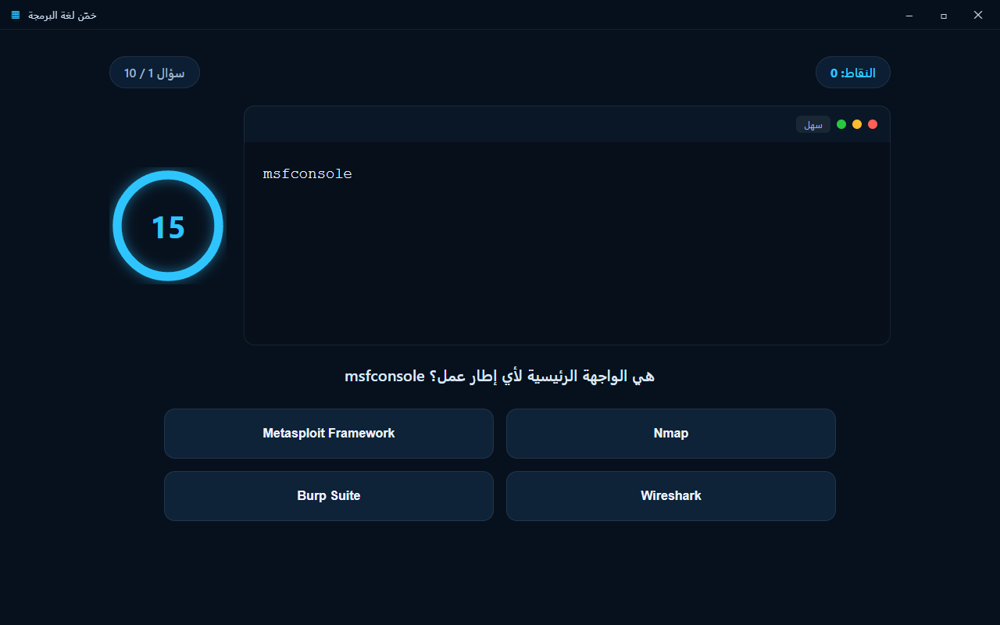
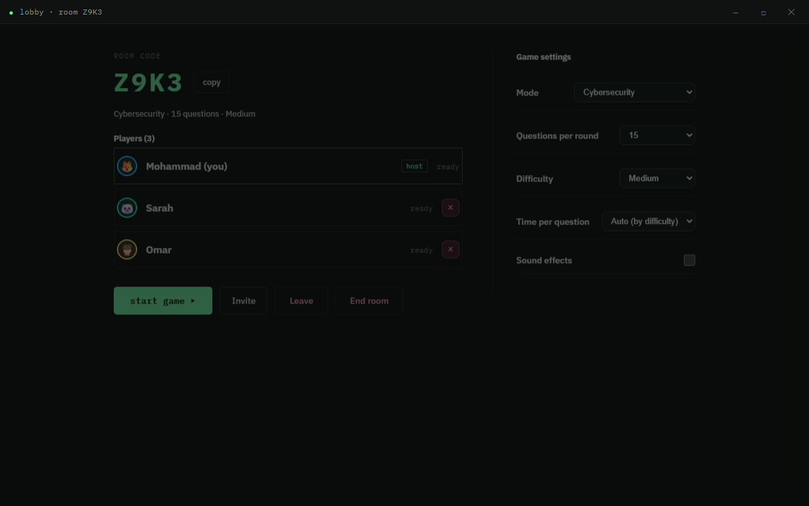
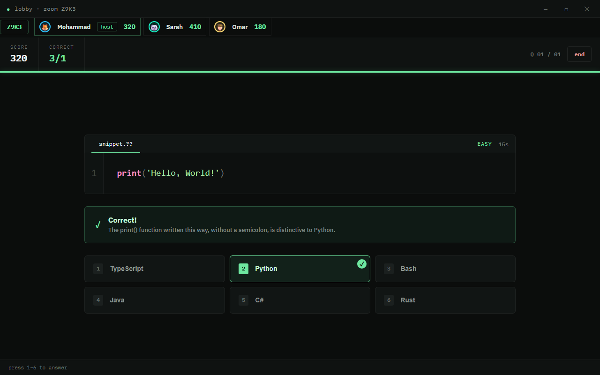
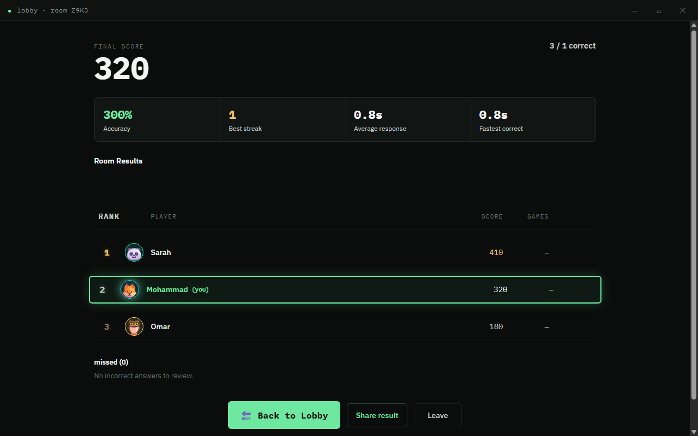

> ⚠️ هذا الملف يصف البنية القديمة (JavaScript عادي). النسخة الحالية أعيدت كتابتها بـ SolidJS + TypeScript + Tailwind — راجع `README.md`.

<div dir="rtl">

# خمّن اللغة

[English](README.md) · **العربية**

لعبة اختبار تفاعلية لأنظمة **Windows** (Electron) وللويب (وأيضاً **تطبيق PWA/جوال**
قابل للتثبيت) ولـ **Discord** (كنشاط مضمّن). من صفحة رئيسية واحدة تختار أحد سبعة أنماط
وتتسابق مع المؤقّت — مع نظام نقاط وسلاسل إجابات وعدّاد صحيح/إجمالي و**لوحة صدارة
عالمية حيّة** لكل نمط (Supabase). **الواجهة كاملة بالعربية والإنجليزية** (مع تخطيط RTL)،
ويمكن التبديل بينهما في أي وقت.

### سبعة أنماط للعب
- **💻 لغات البرمجة** — يظهر مقتطف كود؛ خمّن اللغة. مجموعة من 15 لغة (Python,
  JavaScript, TypeScript, C, C++, C#, Java, Kotlin, Swift, Rust, Go, Ruby, PHP,
  SQL, Bash)؛ يعرض كل سؤال الإجابة الصحيحة مع مشتّتات متغيّرة.
- **🛡️ الأمن السيبراني** — الأدوات والبرمجيات الخبيثة وNmap وأعلامه وMetasploit
  وأدوات الاختبار (Wireshark, Burp, sqlmap, John, Hydra…) والمنافذ والمفاهيم.
- **♾️ DevOps** — Docker وKubernetes وCI/CD وGit وTerraform/Ansible والسحابة (AWS) والمراقبة.
- **🌐 الشبكات** — نموذج OSI وTCP/IP وDNS/DHCP وعناوين IP والتقسيم والتوجيه (OSPF/BGP) والبروتوكولات.
- **🎮 تطوير الألعاب** — حلقات الألعاب والفيزياء والرسوم وECS وتتبّع المسارات والشبكات والمحتوى والواجهات.
- **🧩 حل المشكلات** — **إكمال الكود بملء الفراغ**: اكتب الرمز الناقص في المقتطف. يغطّي الخوارزميات وهياكل البيانات وتعقيد الوقت (Big-O) وأنماط LeetCode (المؤشّران، النافذة المنزلقة، BFS/DFS، البرمجة الديناميكية…)، والتقييم يتجاهل حالة الأحرف والمسافات.
- **🎲 الكل (مدمج)** — البنوك الستة معاً بترتيب عشوائي؛ يُعرض كل سؤال بنمط إجابته الخاص.


| نمط اللغات | نمط الأمن السيبراني |
| --- | --- |
|  |  |

| شاشة النتائج | حول التطبيق |
| --- | --- |
|  |  |

---

## المتطلبات

- [Node.js](https://nodejs.org/) إصدار 18+ (طُوِّرت على v22)
- مدير حِزم — يُفضَّل **pnpm** (npm جيد عادةً، لكنه كان معطّلاً على جهاز التطوير
  فاستُخدم pnpm في كل مكان)
- Windows 10/11

## التشغيل (وضع التطوير)

```powershell
pnpm install      # تثبيت الاعتماديات (Electron)
pnpm start        # تشغيل اللعبة
```

## بناء ملف تنفيذي (.exe)

```powershell
pnpm run dist     # ينتج مُثبّت NSIS داخل مجلد dist/
# أو نسخة محمولة غير مثبّتة:
pnpm run pack
```

الناتج يوضع في مجلد `dist/` (مثل `Guess The Language Setup 3.0.1.exe`).

---

## آلية اللعب

1. عند التشغيل اختر **لغات البرمجة** أو **الأمن السيبراني** (يمكن التبديل لاحقاً عبر زر
   **الأنماط** في القائمة).
2. اضغط **ابدأ اللعب**.
3. يظهر مقتطف/سؤال مع مؤقّت دائري (12–15 ثانية حسب الصعوبة).
4. اختر الإجابة الصحيحة من الأزرار — أو اضغط مفاتيح الأرقام.
5. في النهاية تظهر شاشة النتيجة مع لوحة الصدارة.

بدّل بين **الإنجليزية والعربية** في أي وقت عبر زر EN / ع في القائمة (أو من الإعدادات).
يُحفظ الاختيار، وتقلب العربية الواجهة إلى RTL.

### نظام النقاط
- إجابة صحيحة: **+100**
- مكافأة السرعة: **+10** لكل ثانية متبقية
- سلسلة: مضاعف **×1.5** بعد 3 إجابات صحيحة متتالية
- إجابة خاطئة أو انتهاء الوقت: 0 نقطة وتُصفّر السلسلة

---

## بنية المشروع

```
prog-game2/
├─ package.json                 # السكربتات + إعداد electron-builder
├─ pnpm-workspace.yaml          # السماح ببناء سكربت Electron تحت pnpm
├─ supabase/
│  └─ schema.sql                # جدول لوحة الصدارة + سياسات RLS
├─ src/
│  ├─ main.js                   # عملية Electron الرئيسية (نافذة + IPC)
│  ├─ preload.js                # جسر آمن (window controls + تحميل الأسئلة)
│  ├─ index.html                # الشاشات الثلاث (قائمة / لعب / نتائج)
│  ├─ styles.css                # التصميم الداكن + النيون
│  ├─ renderer.js               # منطق اللعبة، المؤقّت، النقاط، الصدارة
│  ├─ supabase-config.js         # بيانات Supabase (محلي، غير مُتتبَّع بـ git)
│  ├─ supabase-config.example.js # قالب الإعداد
│  └─ data/
│     ├─ questions.json          # بنك اللغات (365 سؤالاً، 15 لغة)
│     ├─ questions-cyber.json    # بنك الأمن السيبراني (110 أسئلة)
│     ├─ questions-devops.json   # بنك DevOps (68 سؤالاً)
│     ├─ questions-network.json  # بنك الشبكات (67 سؤالاً)
│     ├─ questions-gamedev.json  # بنك تطوير الألعاب (50 سؤالاً)
│     └─ questions-algo.json     # بنك حل المشكلات (ملء الفراغ) (54 سؤالاً)
└─ test/
   ├─ smoke-main.js             # نمط اللغات (14 فحصاً)
   ├─ smoke-cyber.js            # نمط الأمن السيبراني (12 فحصاً)
   ├─ smoke-i18n.js             # تبديل اللغة / RTL (9 فحوصات)
   ├─ smoke-online.js           # مسار Supabase (8 فحوصات)
   ├─ capture.js                # التقاط صور للشاشات
   └─ reset-state.js            # تفريغ الحالة المحفوظة محلياً
```

## قواعد بيانات الأسئلة

**اللغات** — يحوي `src/data/questions.json` **365 سؤالاً** على 15 لغة وثلاث مستويات صعوبة:

```json
{
  "id": 1,
  "correctLanguage": "Python",
  "difficulty": "easy",
  "codeSnippet": "print('Hello, World!')",
  "explanation": { "en": "...", "ar": "..." }
}
```

**الأمن السيبراني** — يحوي `src/data/questions-cyber.json` **110 أسئلة** (تصنيفات:
nmap، malware، metasploit، tools، concepts، web)، ولكل سؤال خياراته الخاصة:

```json
{
  "id": 1,
  "category": "nmap",
  "difficulty": "easy",
  "codeSnippet": "nmap -sS 10.0.0.5",
  "question": { "en": "What scan does -sS perform?", "ar": "..." },
  "options": ["TCP SYN (stealth) scan", "UDP scan", "TCP connect scan", "Ping sweep"],
  "answer": "TCP SYN (stealth) scan",
  "explanation": { "en": "...", "ar": "..." }
}
```

البنكان يُولَّدان عبر سكربتات في `scripts/` وتُحمَّل تلقائياً عند التشغيل.

---

## لوحة الصدارة عبر Supabase

اللعبة تعمل محلياً بالكامل بدون إعداد. لتفعيل لوحة صدارة عالمية حقيقية:

1. أنشئ مشروعاً مجانياً على [supabase.com](https://supabase.com).
2. في **SQL Editor**، نفّذ محتوى [`supabase/schema.sql`](supabase/schema.sql)
   (ينشئ جدول `scores` مع سياسات RLS للقراءة والإضافة العامة).
3. انسخ `src/supabase-config.example.js` إلى `src/supabase-config.js`.
4. من **Project Settings → API** انسخ `Project URL` و`anon public key` والصقهما
   في `src/supabase-config.js`.
5. أعد تشغيل اللعبة. ستظهر شاشة النتائج أعلى 10 لاعبين عالمياً مع تمييز صفّك.

> المفتاح `anon` مُصمَّم ليكون عاماً في تطبيقات العميل؛ التحكم بالوصول عبر سياسات
> RLS. إذا تُرك الإعداد فارغاً تعود اللعبة للوحة محلية تجريبية.
> **ملاحظة أمنية:** الإضافة عبر `anon` قابلة للتزوير من العميل؛ لمنع الغش انقل
> إرسال النتيجة إلى Edge Function تتحقق من الجولة (انظر تعليق `schema.sql`).

يُضبط اسمك في اللوحة من شاشة **الإعدادات**.

### غرف متعددة اللاعبين

عند إعداد Supabase:

1. اختر نمطاً من الصفحة الرئيسية ثم **استضافة غرفة** — تحصل على **رمز من 4 أحرف** لمشاركته.
2. الأصدقاء يضغطون **انضمام لغرفة**، يدخلون الرمز، وينتظرون في الردهة.
3. **المضيف (المدير)** يبدأ عندما يكون هناك لاعبان على الأقل. لا يمكن الانضمام بعد بدء اللعبة.
4. الجميع يرى نفس السؤال في الوقت نفسه؛ الإجابات الصحيحة تكسب نقاطاً (نفس معادلة اللعب الفردي).
5. **قائمة لاعبين مباشرة** تعرض الأسماء والنقاط أثناء اللعب.
6. عند انتهاء الجولة تظهر **لوحة نتائج الغرفة** بترتيب اللاعبين.
7. المدير فقط يستطيع **البدء** أو **الإنهاء** أو **طرد** اللاعبين (في الردهة فقط).

| ردهة المضيف | كشف الإجابات | نتائج الغرفة |
| --- | --- | --- |
|  |  |  |

---

## ملاحظات على التصميم

- **محلي أولاً:** اللعبة تعمل كاملة دون إنترنت أو خادم. عند إعداد Supabase تتحوّل
  شاشة المقارنة إلى لوحة صدارة عالمية؛ وبدون إعداد تعود إلى بيانات تجريبية محلية.
- **التظليل اللوني:** محرّك خفيف داخلي بلا اعتماديات خارجية يعمل دون اتصال.
- **الصوت:** نغمات بسيطة عبر WebAudio (لا ملفات صوتية).
- **الأمان:** `contextIsolation` مفعّل و`nodeIntegration` معطّل و`sandbox` مفعّل،
  وسياسة CSP صارمة، وبناء DOM عبر `textContent` (أسماء اللوحة لا تستطيع حقن HTML).
  وتُحفظ النتيجة الأعلى محلياً عبر `localStorage`.

## الاختبارات

```powershell
pnpm exec electron test/smoke-main.js      # اختبار شامل بلا اتصال (13 فحصاً)
pnpm exec electron test/smoke-online.js    # مسار Supabase المتصل (8 فحوصات)
pnpm exec electron test/smoke-multiplayer.js  # اختبار الغرف المتعددة
```

## خارطة الطريق

- ✅ لوحة متصدرين عالمية عبر Supabase
- ✅ غرف متعددة اللاعبين (استضافة/انضمام، اختبار متزامن، لوحة نتائج الغرفة)
- ⏳ تسجيل دخول (Email / Google / Guest)
- ⏳ نظام أصدقاء حقيقي (إضافة/متابعة) بدل اللوحة العامة فقط
- ⏳ إرسال النتيجة عبر Edge Function للتحقق منها (منع الغش)

## الرخصة

رخصة MIT — انظر ملف [LICENSE](LICENSE).

</div>
