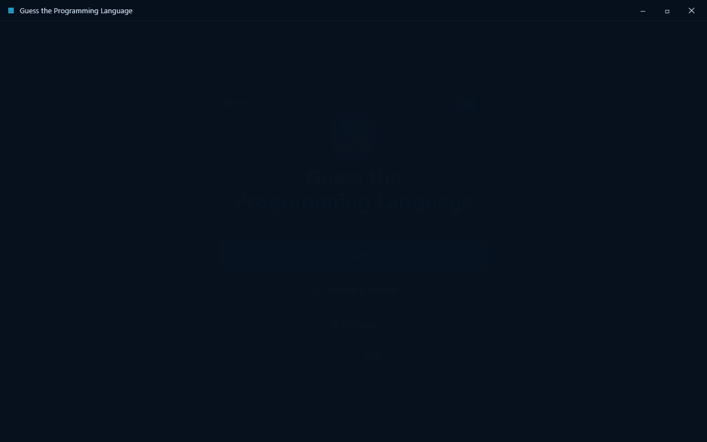
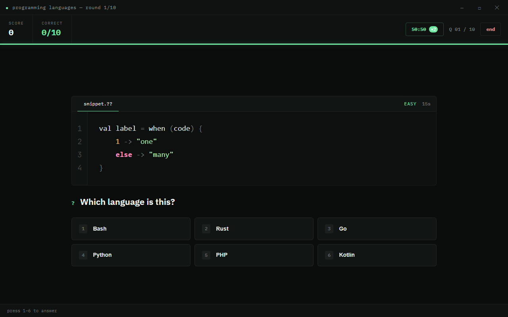
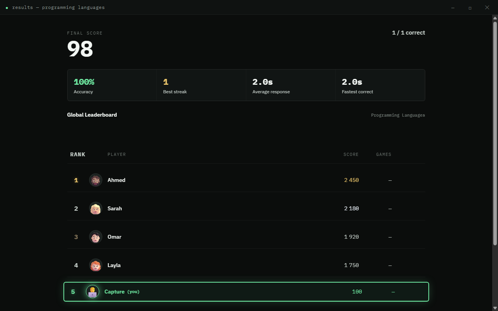

<div dir="rtl">

# خمّن لغة البرمجة

[English](README.md) · **العربية**

لعبة سطح مكتب تفاعلية لنظام **Windows** مبنية بـ **Electron**. يظهر مقتطف كود غامض
وعليك تحديد لغة البرمجة قبل انتهاء المؤقّت — مع نظام نقاط وسلاسل إجابات ولوحة صدارة
للأصدقاء/عالمية.



| أثناء اللعب | شاشة النتائج |
| --- | --- |
|  |  |

---

## المتطلبات

- [Node.js](https://nodejs.org/) إصدار 18+ (طُوِّرت على v22)
- مدير حِزم — يُفضَّل **pnpm** (npm جيد عادةً، لكنه كان معطّلاً على جهاز التطوير
  فاستُخدم pnpm في كل مكان)
- Windows 10/11

## التشغيل (وضع التطوير)

```powershell
pnpm install      # تثبيت الاعتماديات (Electron)
pnpm start        # تشغيل اللعبة
```

## بناء ملف تنفيذي (.exe)

```powershell
pnpm run dist     # ينتج مُثبّت NSIS داخل مجلد dist/
# أو نسخة محمولة غير مثبّتة:
pnpm run pack
```

الناتج يوضع في مجلد `dist/` (مثل `Guess The Language Setup 1.0.0.exe`).

---

## آلية اللعب

1. اضغط **ابدأ اللعب**.
2. يظهر مقتطف كود مع مؤقّت دائري (12–15 ثانية حسب الصعوبة).
3. اختر اللغة الصحيحة من الأزرار الستة — أو اضغط مفاتيح الأرقام **1–6**.
4. في النهاية تظهر شاشة النتيجة مع لوحة الصدارة.

### نظام النقاط
- إجابة صحيحة: **+100**
- مكافأة السرعة: **+10** لكل ثانية متبقية
- سلسلة: مضاعف **×1.5** بعد 3 إجابات صحيحة متتالية
- إجابة خاطئة أو انتهاء الوقت: 0 نقطة وتُصفّر السلسلة

---

## بنية المشروع

```
prog-game2/
├─ package.json                 # السكربتات + إعداد electron-builder
├─ pnpm-workspace.yaml          # السماح ببناء سكربت Electron تحت pnpm
├─ supabase/
│  └─ schema.sql                # جدول لوحة الصدارة + سياسات RLS
├─ src/
│  ├─ main.js                   # عملية Electron الرئيسية (نافذة + IPC)
│  ├─ preload.js                # جسر آمن (window controls + تحميل الأسئلة)
│  ├─ index.html                # الشاشات الثلاث (قائمة / لعب / نتائج)
│  ├─ styles.css                # التصميم الداكن + النيون
│  ├─ renderer.js               # منطق اللعبة، المؤقّت، النقاط، الصدارة
│  ├─ supabase-config.js         # بيانات Supabase (محلي، غير مُتتبَّع بـ git)
│  ├─ supabase-config.example.js # قالب الإعداد
│  └─ data/
│     └─ questions.json          # قاعدة بيانات الأسئلة (120 سؤالاً)
└─ test/
   ├─ smoke-main.js             # اختبار آلي شامل بدون واجهة (13 فحصاً)
   ├─ smoke-online.js           # اختبار مسار Supabase (بـ fetch وهمي)
   ├─ capture.js                # التقاط صور للشاشات
   └─ reset-state.js            # تفريغ الحالة المحفوظة محلياً
```

## قاعدة بيانات الأسئلة

يحوي `src/data/questions.json` **120 سؤالاً** موزّعة على 6 لغات (Python و
JavaScript و C++ و Java و Rust و Go) وثلاث مستويات صعوبة. كل عنصر:

```json
{
  "id": 1,
  "correctLanguage": "Python",
  "difficulty": "easy",
  "codeSnippet": "print('Hello, World!')",
  "explanation": "دالة print() مميزة في بايثون."
}
```

لإضافة أسئلة: أضِف عناصر جديدة بالشكل نفسه؛ تُحمَّل تلقائياً عند التشغيل.

---

## لوحة الصدارة عبر Supabase

اللعبة تعمل محلياً بالكامل بدون إعداد. لتفعيل لوحة صدارة عالمية حقيقية:

1. أنشئ مشروعاً مجانياً على [supabase.com](https://supabase.com).
2. في **SQL Editor**، نفّذ محتوى [`supabase/schema.sql`](supabase/schema.sql)
   (ينشئ جدول `scores` مع سياسات RLS للقراءة والإضافة العامة).
3. انسخ `src/supabase-config.example.js` إلى `src/supabase-config.js`.
4. من **Project Settings → API** انسخ `Project URL` و`anon public key` والصقهما
   في `src/supabase-config.js`.
5. أعد تشغيل اللعبة. ستظهر شاشة النتائج أعلى 10 لاعبين عالمياً مع تمييز صفّك.

> المفتاح `anon` مُصمَّم ليكون عاماً في تطبيقات العميل؛ التحكم بالوصول عبر سياسات
> RLS. إذا تُرك الإعداد فارغاً تعود اللعبة للوحة محلية تجريبية.
> **ملاحظة أمنية:** الإضافة عبر `anon` قابلة للتزوير من العميل؛ لمنع الغش انقل
> إرسال النتيجة إلى Edge Function تتحقق من الجولة (انظر تعليق `schema.sql`).

يُضبط اسمك في اللوحة من شاشة **الإعدادات**.

---

## ملاحظات على التصميم

- **محلي أولاً:** اللعبة تعمل كاملة دون إنترنت أو خادم. عند إعداد Supabase تتحوّل
  شاشة المقارنة إلى لوحة صدارة عالمية؛ وبدون إعداد تعود إلى بيانات تجريبية محلية.
- **التظليل اللوني:** محرّك خفيف داخلي بلا اعتماديات خارجية يعمل دون اتصال.
- **الصوت:** نغمات بسيطة عبر WebAudio (لا ملفات صوتية).
- **الأمان:** `contextIsolation` مفعّل و`nodeIntegration` معطّل و`sandbox` مفعّل،
  وسياسة CSP صارمة، وبناء DOM عبر `textContent` (أسماء اللوحة لا تستطيع حقن HTML).
  وتُحفظ النتيجة الأعلى محلياً عبر `localStorage`.

## الاختبارات

```powershell
pnpm exec electron test/smoke-main.js      # اختبار شامل بلا اتصال (13 فحصاً)
pnpm exec electron test/smoke-online.js    # مسار Supabase المتصل (8 فحوصات)
```

## خارطة الطريق

- ✅ لوحة متصدرين عالمية عبر Supabase
- ⏳ تسجيل دخول (Email / Google / Guest)
- ⏳ نظام أصدقاء حقيقي (إضافة/متابعة) بدل اللوحة العامة فقط
- ⏳ إرسال النتيجة عبر Edge Function للتحقق منها (منع الغش)

## الرخصة

MIT

</div>
