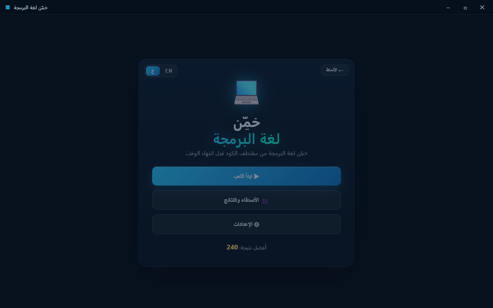
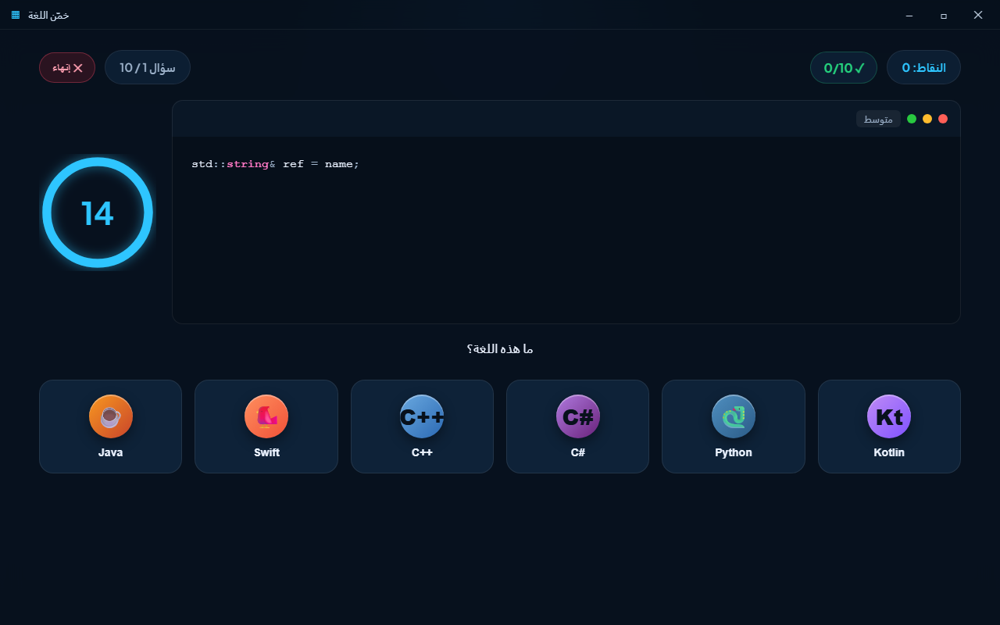
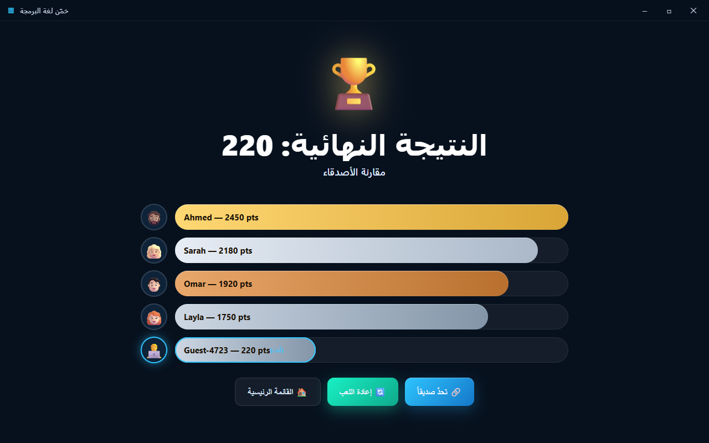

# Guess the Programming Language

**English** · [العربية](README.ar.md)

An interactive **Windows** desktop game built with **Electron**. A mystery code
snippet appears and you must identify the programming language before the timer
runs out — with scoring, streaks, and a friends/global leaderboard. The entire
UI is available in **English and Arabic** (with full RTL layout), switchable
from the menu.


| Gameplay | Results |
| --- | --- |
|  |  |

Arabic (RTL):

| Menu (AR) | Gameplay (AR) | Results (AR) |
| --- | --- | --- |
|  |  |  |

---

## Requirements

- [Node.js](https://nodejs.org/) 18+ (developed on v22)
- A package manager — **pnpm** is recommended (`npm` is fine elsewhere; on the
  dev machine npm was broken, so pnpm is used throughout)
- Windows 10/11

## Run (development)

```powershell
pnpm install      # install dependencies (Electron)
pnpm start        # launch the game
```

## Build a Windows installer (.exe)

```powershell
pnpm run dist     # produces an NSIS installer in dist/
# or a portable, uninstalled build:
pnpm run pack
```

The output is written to `dist/` (e.g. `Guess The Language Setup 1.0.0.exe`).

---

## How to play

1. Click **Start**.
2. A code snippet appears with a circular countdown (12–15s by difficulty).
3. Pick the correct language from the six buttons — or press keys **1–6**.
4. After the round, the results screen shows your score and the leaderboard.

Switch between **English and Arabic** anytime via the EN / ع toggle in the menu
(also under Settings). The choice is persisted, and Arabic flips the UI to RTL.

### Scoring
- Correct answer: **+100**
- Speed bonus: **+10** per remaining second
- Streak: **×1.5** multiplier after 3 correct answers in a row
- Wrong answer or timeout: 0 points and the streak resets

---

## Project structure

```
prog-game2/
├─ package.json                 # scripts + electron-builder config
├─ pnpm-workspace.yaml          # allows Electron's build script under pnpm
├─ supabase/
│  └─ schema.sql                # leaderboard table + RLS policies
├─ src/
│  ├─ main.js                   # Electron main process (window + IPC)
│  ├─ preload.js                # secure bridge (window controls + question load)
│  ├─ index.html                # the three screens (menu / game / results)
│  ├─ styles.css                # dark + neon theme
│  ├─ renderer.js               # game logic, timer, scoring, leaderboard
│  ├─ supabase-config.js         # Supabase creds (local, git-ignored)
│  ├─ supabase-config.example.js # config template
│  └─ data/
│     └─ questions.json          # questions database (180 questions)
└─ test/
   ├─ smoke-main.js             # headless end-to-end test (13 checks)
   ├─ smoke-online.js           # Supabase online-path test (stubbed fetch)
   ├─ capture.js                # render screenshots of each screen
   └─ reset-state.js            # clear persisted local state
```

## Questions database

`src/data/questions.json` holds **180 questions** across 6 languages (Python,
JavaScript, C++, Java, Rust, Go) and three difficulty levels. Each entry:

```json
{
  "id": 1,
  "correctLanguage": "Python",
  "difficulty": "easy",
  "codeSnippet": "print('Hello, World!')",
  "explanation": {
    "en": "The print() function written this way is a Python signature.",
    "ar": "دالة print() بهذا الشكل مميزة في بايثون."
  }
}
```

To add questions, append new objects in the same shape. They load automatically.

---

## Cloud leaderboard (Supabase)

The game is fully playable offline with no setup. To enable a real global
leaderboard:

1. Create a free project at [supabase.com](https://supabase.com).
2. In the **SQL Editor**, run [`supabase/schema.sql`](supabase/schema.sql)
   (creates the `scores` table with public read/insert RLS policies).
3. Copy `src/supabase-config.example.js` to `src/supabase-config.js`.
4. From **Project Settings → API**, paste your `Project URL` and the public
   `anon` key into `src/supabase-config.js`.
5. Restart the app. The results screen now shows the global top 10 with your
   row highlighted.

> The `anon` key is meant to be public in client apps; access is governed by RLS
> policies. If left blank, the game falls back to a local mock leaderboard.
> **Security note:** anon inserts are spoofable from a client. To prevent
> cheating, move score submission behind an Edge Function that validates the run
> (see the comment in `schema.sql`).

Your leaderboard name is set in the **Settings** screen.

---

## Implementation notes

- **Local-first:** the game runs fully without internet or a server. With
  Supabase configured, the comparison screen becomes a real global leaderboard;
  without it, it falls back to local mock data.
- **Syntax highlighting:** a small built-in highlighter — no external
  dependencies, works offline.
- **Sound:** simple WebAudio tones (no audio asset files).
- **Security:** `contextIsolation` on, `nodeIntegration` off, `sandbox` on, a
  strict CSP, and DOM built with `textContent` (leaderboard names can't inject
  markup). High score is stored locally via `localStorage`.

## Tests

```powershell
pnpm exec electron test/smoke-main.js      # offline end-to-end (13 checks)
pnpm exec electron test/smoke-online.js    # Supabase online path (8 checks)
```

## Roadmap

- ✅ Global leaderboard via Supabase
- ⏳ Login (Email / Google / Guest)
- ⏳ Real friends system (add / follow) instead of a global board only
- ⏳ Server-validated score submission (anti-cheat) via Edge Function

## License

MIT
