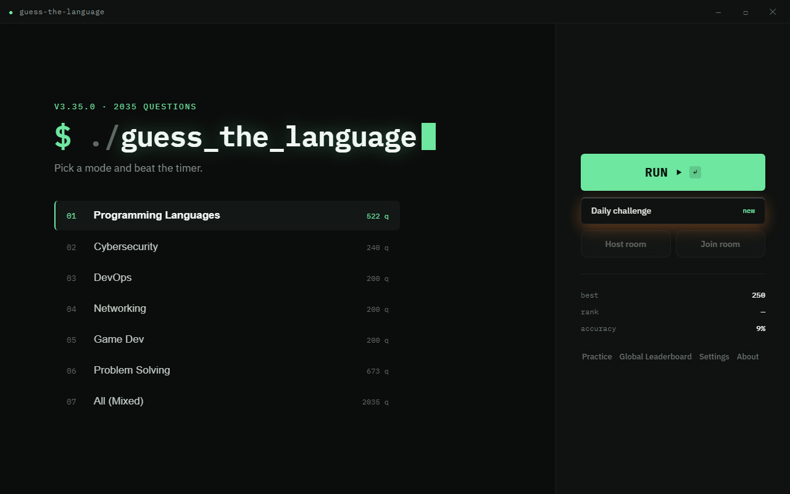
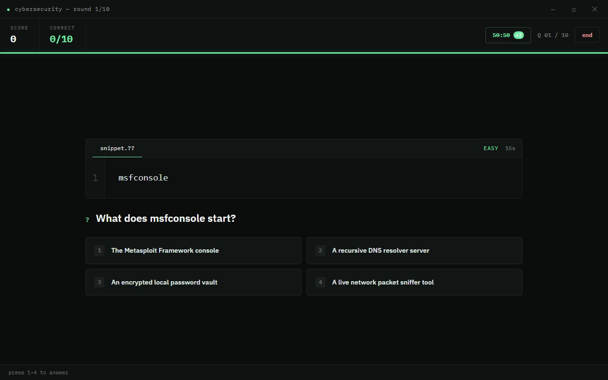
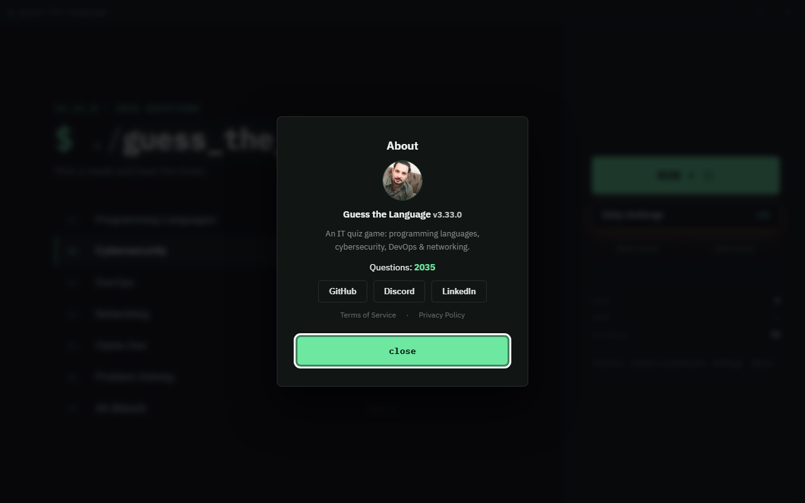
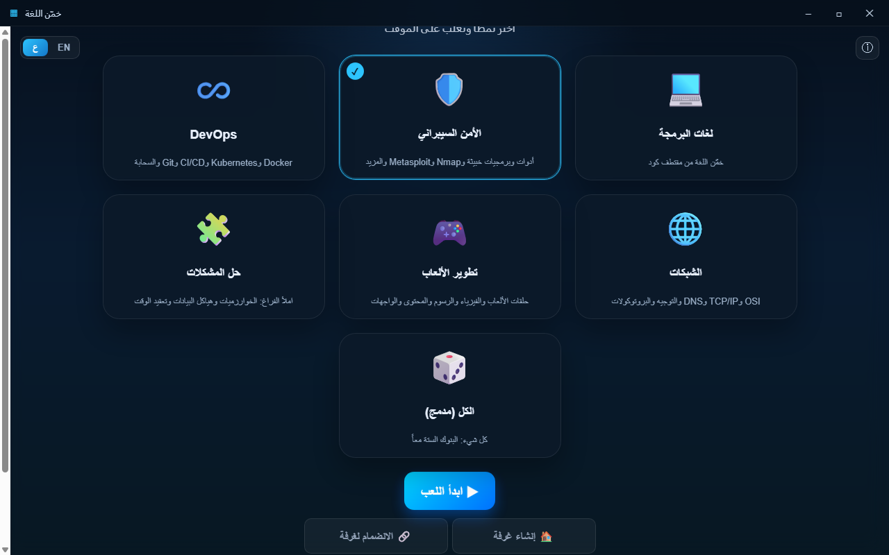

# Guess the Language

**English** · [العربية](README.ar.md)

An interactive **Windows** desktop game built with **Electron**. From a single
home page you pick one of five quiz modes and race the timer — with scoring,
streaks, a correct/total counter, and a per-mode **live global leaderboard**
(Supabase). The entire UI is available in **English and Arabic** (with full RTL
layout), switchable anytime.

### Five game modes
- **💻 Programming Languages** — a code snippet appears; guess the language
  (Python, JavaScript, C++, Java, Rust, Go).
- **🛡️ Cybersecurity** — tools, malware, Nmap (and its flags), Metasploit,
  pentest tools (Wireshark, Burp, sqlmap, John, Hydra…), ports and concepts.
- **♾️ DevOps** — Docker, Kubernetes, CI/CD, Git, Terraform/Ansible, cloud (AWS)
  and monitoring (Prometheus/Grafana).
- **🌐 Networking** — OSI model, TCP/IP, DNS/DHCP, IP & subnetting, routing
  (OSPF/BGP), ports and protocols.
- **🎲 All (Mixed)** — all four banks shuffled together; each question renders
  with its own answer style.



| Languages mode | Cybersecurity mode |
| --- | --- |
|  |  |

| Results | About |
| --- | --- |
|  |  |

Arabic (RTL):

| Home (AR) | Gameplay (AR) | Results (AR) |
| --- | --- | --- |
|  |  |  |

---

## Requirements

- [Node.js](https://nodejs.org/) 18+ (developed on v22)
- A package manager — **pnpm** is recommended (`npm` is fine elsewhere; on the
  dev machine npm was broken, so pnpm is used throughout)
- Windows 10/11

## Run (development)

```powershell
pnpm install      # install dependencies (Electron)
pnpm start        # launch the game
```

## Build a Windows installer (.exe)

```powershell
pnpm run dist     # produces an NSIS installer in dist/
# or a portable, uninstalled build:
pnpm run pack
```

The output is written to `dist/` (e.g. `Guess The Language Setup 2.4.0.exe`).

---

## How to play

Everything starts on one **home page**: pick a mode card, then **Start**, view
the **leaderboard** (Friends & Scores), open **Settings**, or read **About** — all
without leaving the page.

1. Tap a mode card to select it, then **Start**.
2. A snippet/question appears with a circular countdown (12–15s by difficulty).
3. Pick the correct answer from the buttons — or press the number keys. The HUD
   shows your score and a **correct/total** counter; you can **End** the quiz
   early to jump to the results.
4. The results screen shows your score, how many you got right, and the
   leaderboard. Your name defaults to **User** (change it in Settings).

Switch between **English and Arabic** anytime via the EN / ع toggle (also under
Settings). The choice is persisted, and Arabic flips the UI to RTL.

### Scoring
- Correct answer: **+100**
- Speed bonus: **+10** per remaining second
- Streak: **×1.5** multiplier after 3 correct answers in a row
- Wrong answer or timeout: 0 points and the streak resets

---

## Project structure

```
prog-game2/
├─ package.json                 # scripts + electron-builder config
├─ pnpm-workspace.yaml          # allows Electron's build script under pnpm
├─ supabase/
│  └─ schema.sql                # leaderboard table + RLS policies
├─ src/
│  ├─ main.js                   # Electron main process (window + IPC)
│  ├─ preload.js                # secure bridge (window controls + question load)
│  ├─ index.html                # the three screens (home / game / results)
│  ├─ styles.css                # dark + neon theme
│  ├─ renderer.js               # game logic, modes, timer, scoring, leaderboard
│  ├─ supabase-config.js         # Supabase creds (local, git-ignored)
│  ├─ supabase-config.example.js # config template
│  └─ data/
│     ├─ questions.json          # languages bank (211 questions)
│     ├─ questions-cyber.json    # cybersecurity bank (79 questions)
│     ├─ questions-devops.json   # devops bank (38 questions)
│     └─ questions-network.json  # networking bank (37 questions)
└─ test/
   ├─ smoke-main.js             # languages mode end-to-end (14 checks)
   ├─ smoke-cyber.js            # cybersecurity mode (12 checks)
   ├─ smoke-newmodes.js         # devops + networking modes (10 checks)
   ├─ smoke-i18n.js             # language switch / RTL (9 checks)
   ├─ smoke-online.js           # Supabase online-path test (8 checks)
   ├─ smoke-all.js              # All (mixed) mode (10 checks)
   ├─ capture.js                # render screenshots of each screen
   └─ reset-state.js            # clear persisted local state
```

## Questions databases

**Languages** — `src/data/questions.json` holds **211 questions** across 6
languages and three difficulty levels:

```json
{
  "id": 1,
  "correctLanguage": "Python",
  "difficulty": "easy",
  "codeSnippet": "print('Hello, World!')",
  "explanation": { "en": "...", "ar": "..." }
}
```

**Cybersecurity / DevOps / Networking** — `questions-cyber.json` (79),
`questions-devops.json` (38) and `questions-network.json` (37) are
multiple-choice banks. Each entry has its own options:

```json
{
  "id": 1,
  "category": "nmap",
  "difficulty": "easy",
  "codeSnippet": "nmap -sS 10.0.0.5",
  "question": { "en": "What scan does -sS perform?", "ar": "..." },
  "options": ["TCP SYN (stealth) scan", "UDP scan", "TCP connect scan", "Ping sweep"],
  "answer": "TCP SYN (stealth) scan",
  "explanation": { "en": "...", "ar": "..." }
}
```

The quiz banks are generated by helper scripts in `scripts/` and load automatically.

---

## Cloud leaderboard (Supabase)

The game is fully playable offline with no setup. To enable a real global
leaderboard:

1. Create a free project at [supabase.com](https://supabase.com).
2. In the **SQL Editor**, run [`supabase/schema.sql`](supabase/schema.sql)
   (creates the `scores` table with public read/insert RLS policies).
3. Copy `src/supabase-config.example.js` to `src/supabase-config.js`.
4. From **Project Settings → API**, paste your `Project URL` and the public
   `anon` key into `src/supabase-config.js`.
5. Restart the app. The results screen now shows the global top 10 with your
   row highlighted.

> The `anon` key is meant to be public in client apps; access is governed by RLS
> policies. If left blank, the game falls back to a local mock leaderboard.
> **Security note:** anon inserts are spoofable from a client. To prevent
> cheating, move score submission behind an Edge Function that validates the run
> (see the comment in `schema.sql`).

Your leaderboard name is set in the **Settings** screen.

---

## Implementation notes

- **Local-first:** the game runs fully without internet or a server. With
  Supabase configured, the comparison screen becomes a real global leaderboard;
  without it, it falls back to local mock data.
- **Syntax highlighting:** a small built-in highlighter — no external
  dependencies, works offline.
- **Sound:** simple WebAudio tones (no audio asset files).
- **Security:** `contextIsolation` on, `nodeIntegration` off, `sandbox` on, a
  strict CSP, and DOM built with `textContent` (leaderboard names can't inject
  markup). High score is stored locally via `localStorage`.

## Tests

```powershell
pnpm exec electron test/smoke-main.js      # offline end-to-end (13 checks)
pnpm exec electron test/smoke-online.js    # Supabase online path (8 checks)
```

## Roadmap

- ✅ Global leaderboard via Supabase
- ⏳ Login (Email / Google / Guest)
- ⏳ Real friends system (add / follow) instead of a global board only
- ⏳ Server-validated score submission (anti-cheat) via Edge Function

## License

MIT — see [LICENSE](LICENSE).
